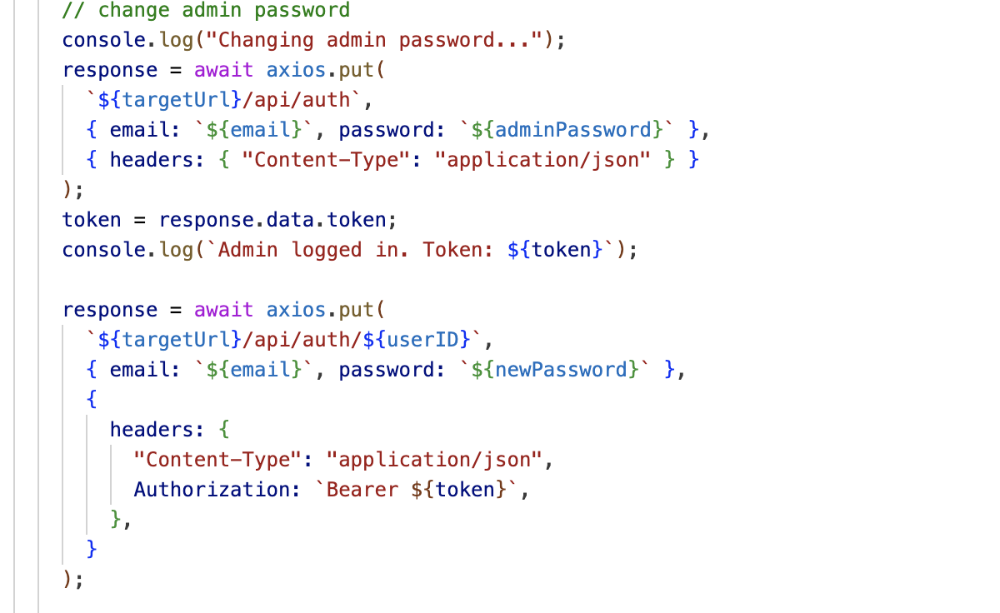
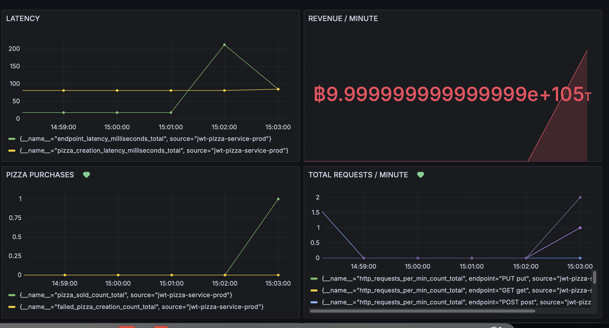
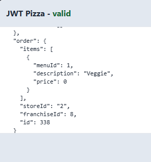
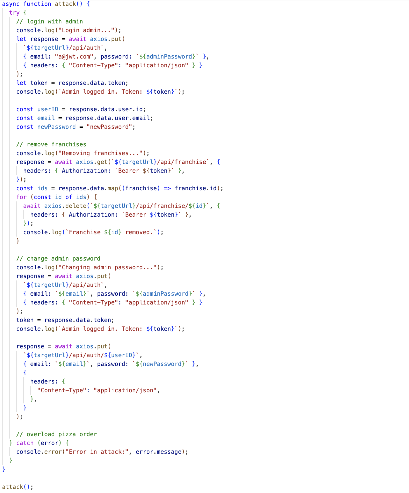

### Self attack record

| Item           | Result                                                                         |
| -------------- | ------------------------------------------------------------------------------ |
| Date           | April 15, 2025                                                                 |
| Target         | https://pizza.bvanitem.com/                                                      |
| Classification | Server side request forgery                                                                      |
| Severity       | 10                                                                              |
| Description    | Script deleted admins password and resets it to newPassword.                 |
| Images         |  |
| Corrections    | Place more permissions checks to not allow this to be changed so easily. 

### Self attack record

| Item           | Result                                                                         |
| -------------- | ------------------------------------------------------------------------------ |
| Date           | April 15, 2025                                                                 |
| Target         | https://pizza.bvanitem.com/                                                      |
| Classification | Injection                                                                      |
| Severity       | 3                                                                              |
| Description    | Can set the price to become the richest man on the planet.                |
| Images         |  |
| Corrections    | Have to make sure when pizza verification occurs that the final amount is verified and appropriate. 

### Peer attack record 1

| Item           | Result                                                                         |
| -------------- | ------------------------------------------------------------------------------ |
| Date           | April 15, 2025                                                                 |
| Target         | https://pizza.sobolo.click/                                                       |
| Classification | Injection                                                                      |
| Severity       | 3                                                                             |
| Description    | Set price to zero and it was verified upon checking out. Using Intercept tool.                |
| Images         | |
| Corrections    | Store data on the backend and make sure it cannot be edited before the transaction is sent. 

### Peer attack record 2

| Item           | Result                                                                         |
| -------------- | ------------------------------------------------------------------------------ |
| Date           | April 15, 2025                                                                 |
| Target         | https://pizza.bvanitem.com/                                                       |
| Classification | Server side request forgery                                                                      |
| Severity       | 10                                                                              |
| Description    | Script deleted all of my franchises! It also no longer recognized the f@jwt.com as an existing franchisee. Making them unable to make new stores.              |
| Images         |    Stores and menu no longer accessible. |
| Corrections    | Have a more secure backend managing root level database commands. Restrict who can change the database. 
